

 

> A collection of UI/UX designs, presentation decks, and visual identities across mobile apps, SaaS platforms, and web products — all crafted in Figma.

---

### 📱 سلس — AI Umrah Companion App

> AI-powered mobile app that guides pilgrims through a personalized Umrah experience with smart scheduling, real-time tracking, and an Arabic AI assistant.

<table>
<tr>
<td width="25%">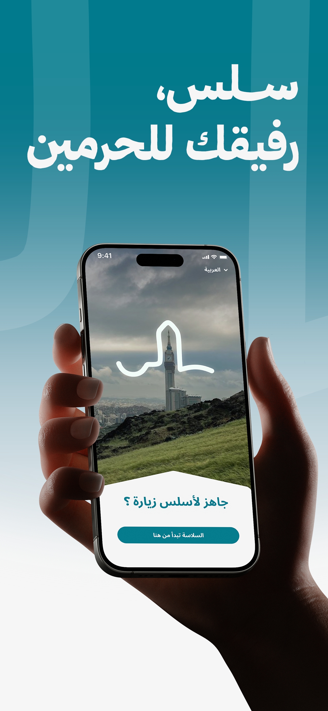</td>
<td width="25%">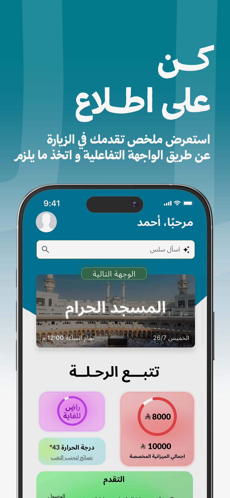</td>
<td width="25%">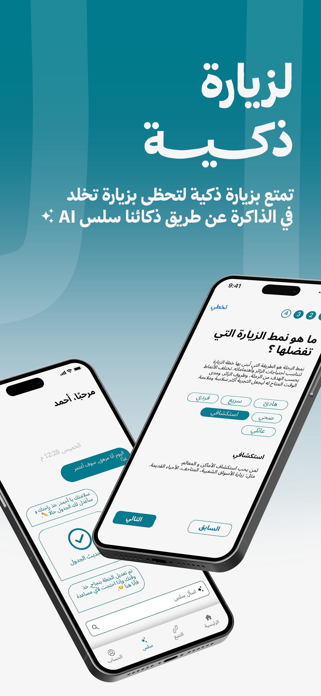</td>
<td width="25%">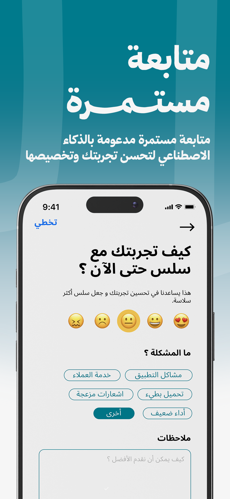</td>
</tr>
</table>

---

### ⚖️ تباين — Legal Comparison Platform

> A web platform that helps users understand differences between Saudi laws and international equivalents through side-by-side AI-powered comparisons.

<table>
<tr>
<td width="50%"></td>
<td width="50%">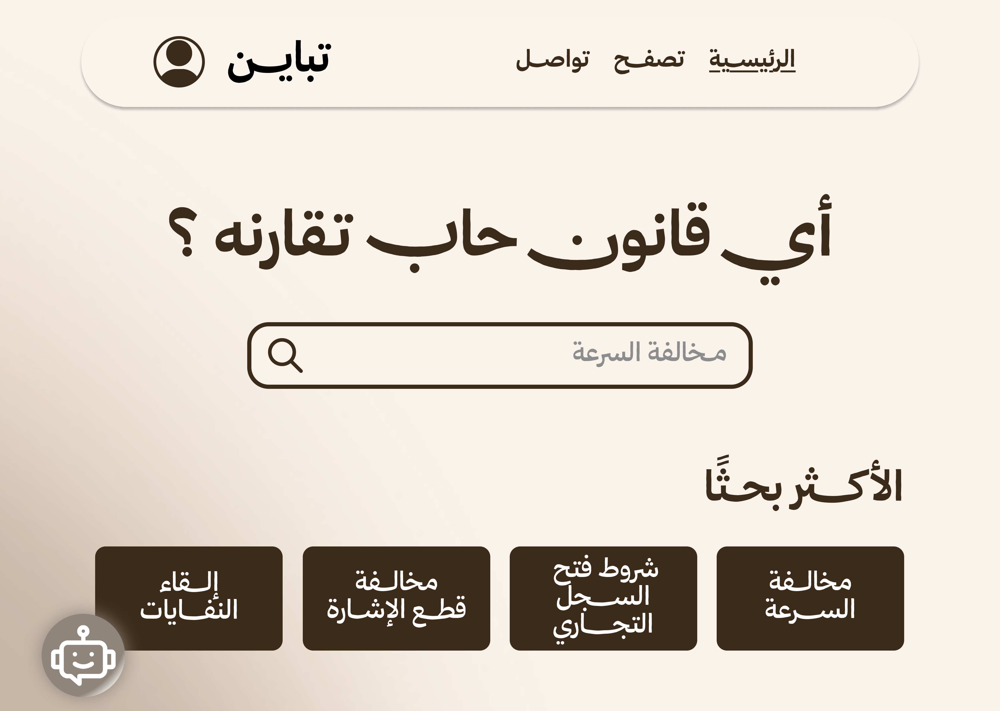</td>
</tr>
<tr>
<td width="50%">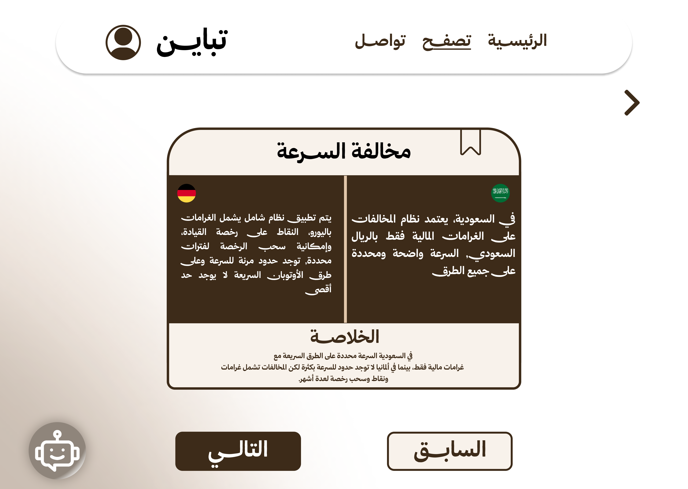</td>
<td width="50%">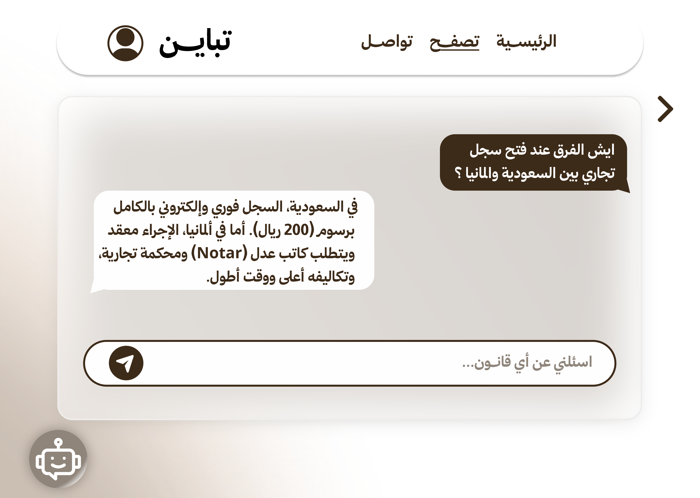</td>
</tr>
</table>

---

### 🏆 فوازير — SaaS Competition Platform

> Full-stack SaaS platform for managing multi-day competitions with real-time scoring, AI assistance, and automated admin workflows.

<table>
<tr>
<td width="50%">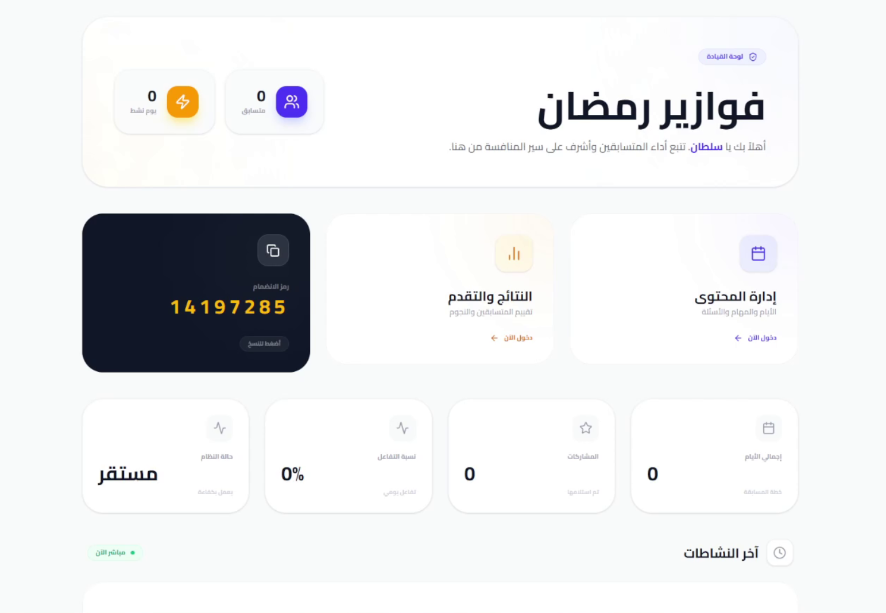</td>
<td width="50%">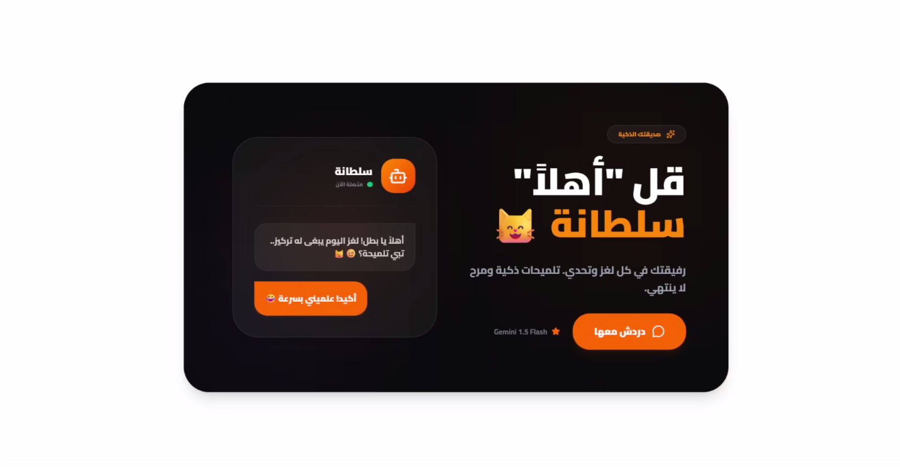</td>
</tr>
</table>

---

### 🏛️ أطلال — AR Heritage App

> AR/AI mobile app that lets users experience historical Saudi landmarks as they appeared in the past, with GPS navigation and gamification.

<table>
<tr>
<td width="50%">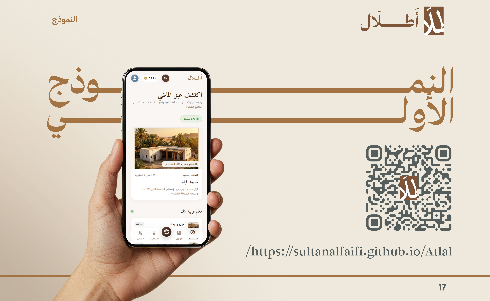</td>
<td width="50%">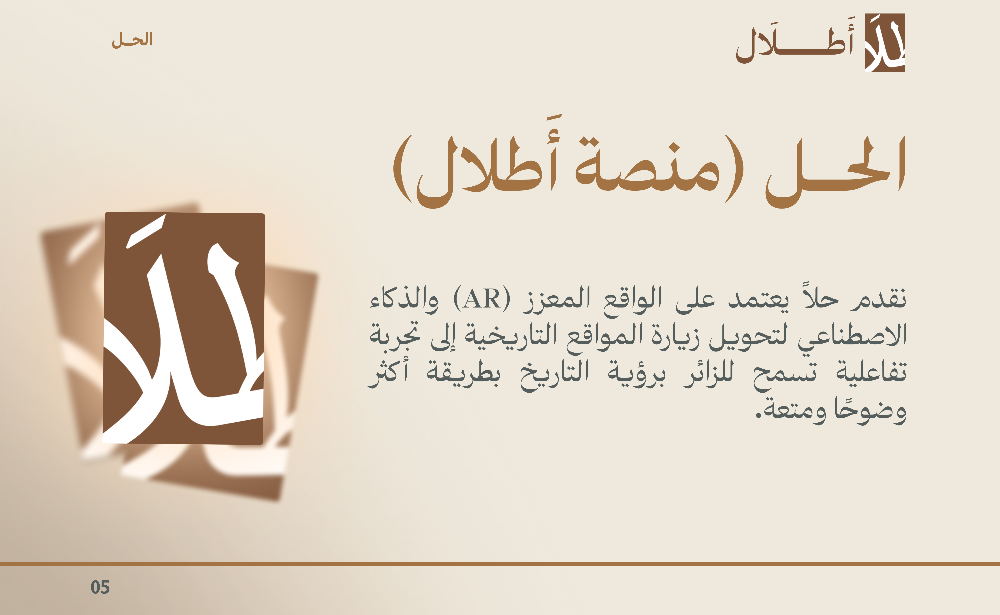</td>
</tr>
</table>

---

### 🌍 السعودية في اليونيسكو — Heritage Web Platform

> A web platform showcasing Saudi Arabia's cultural and natural heritage registered with UNESCO — material and intangible heritage.

<table>
<tr>
<td width="50%">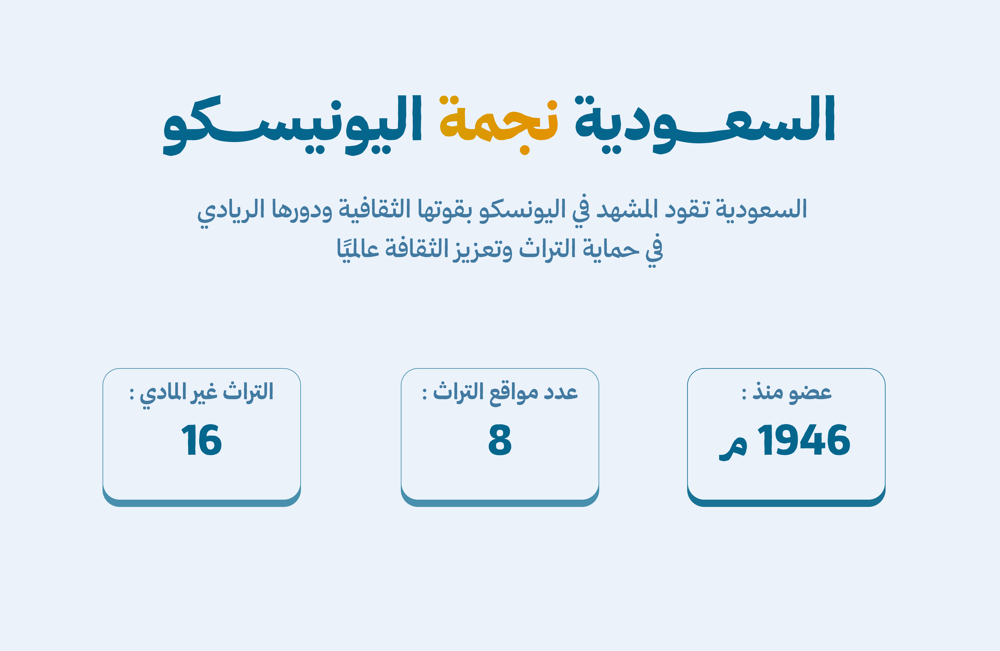</td>
<td width="50%">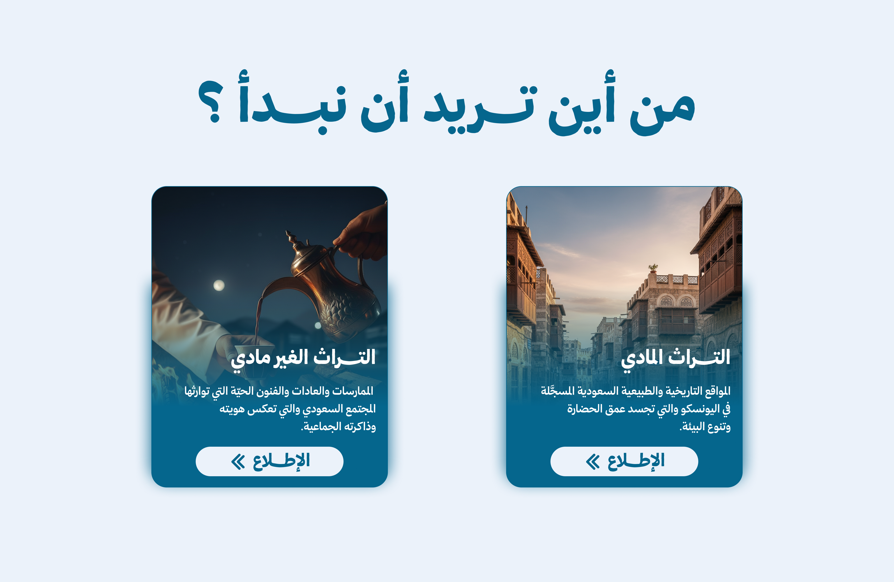</td>
</tr>
</table>

---

### 📊 Presentation Designs

> Branded presentation decks designed for academic and professional contexts — including UQU × Tuwaiq Academy and Tabayun pitch deck.

<table>
<tr>
<td width="50%">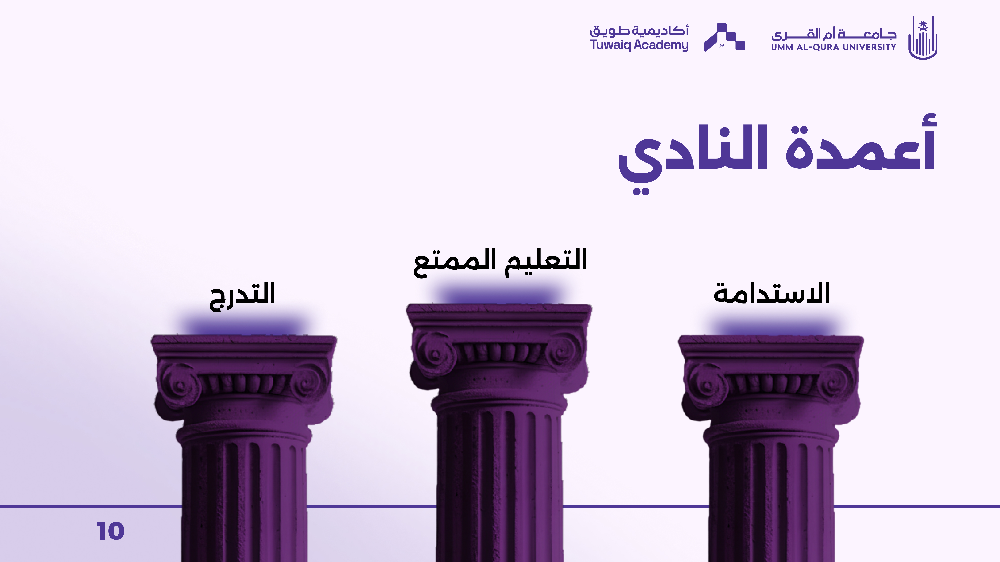</td>
<td width="50%">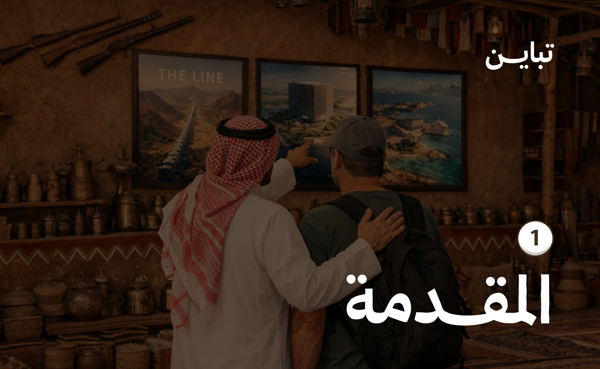</td>
</tr>
<tr>
<td width="50%">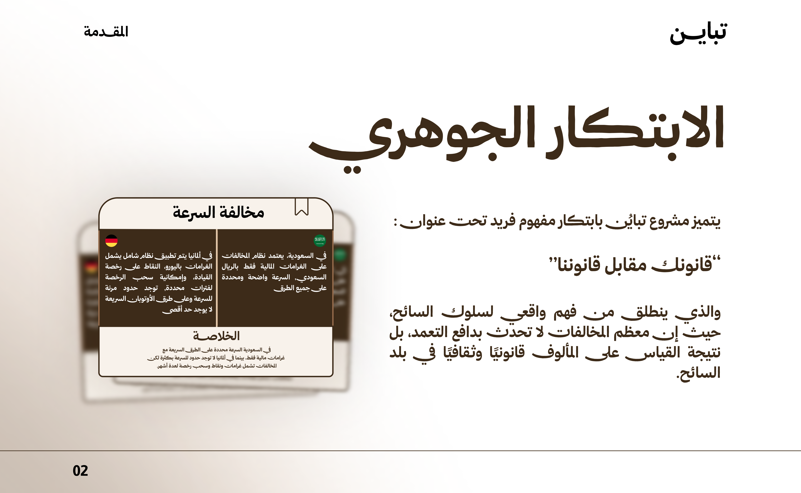</td>
<td width="50%">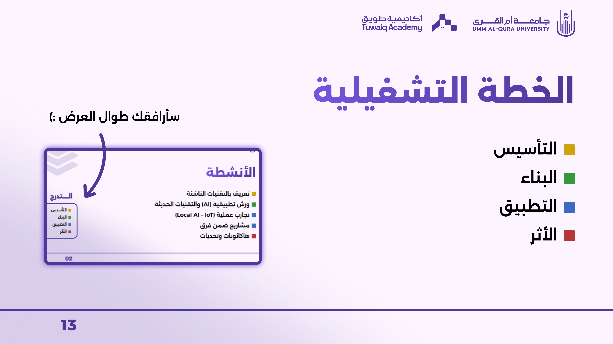</td>
</tr>
</table>

---

